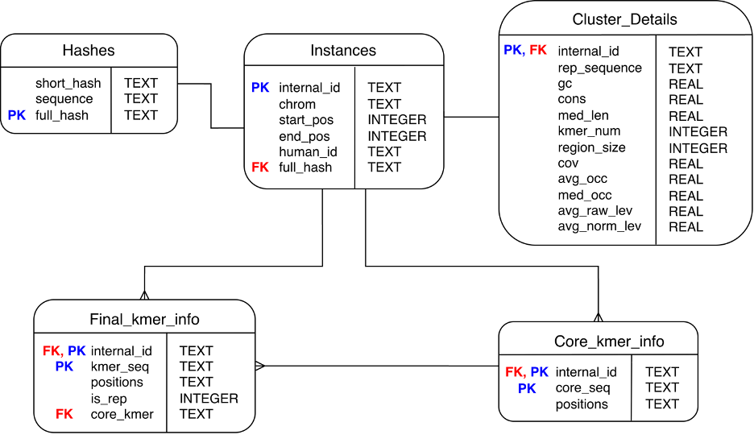
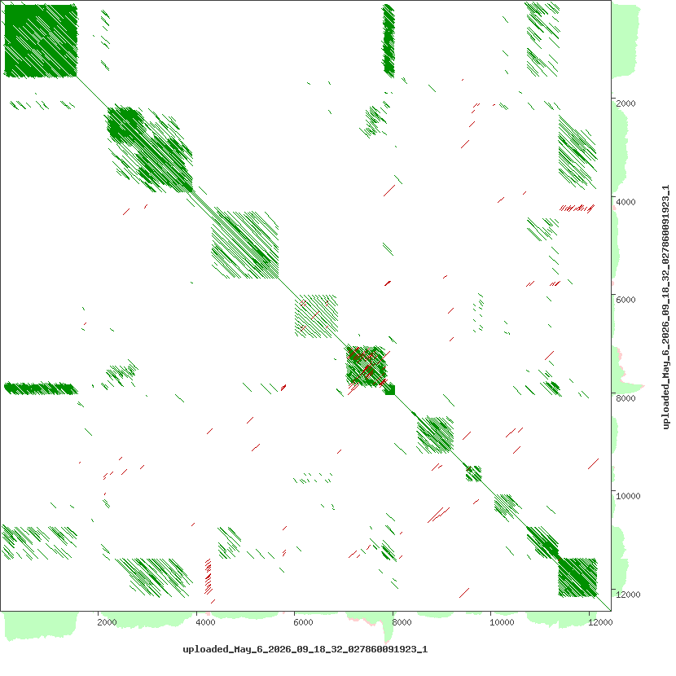
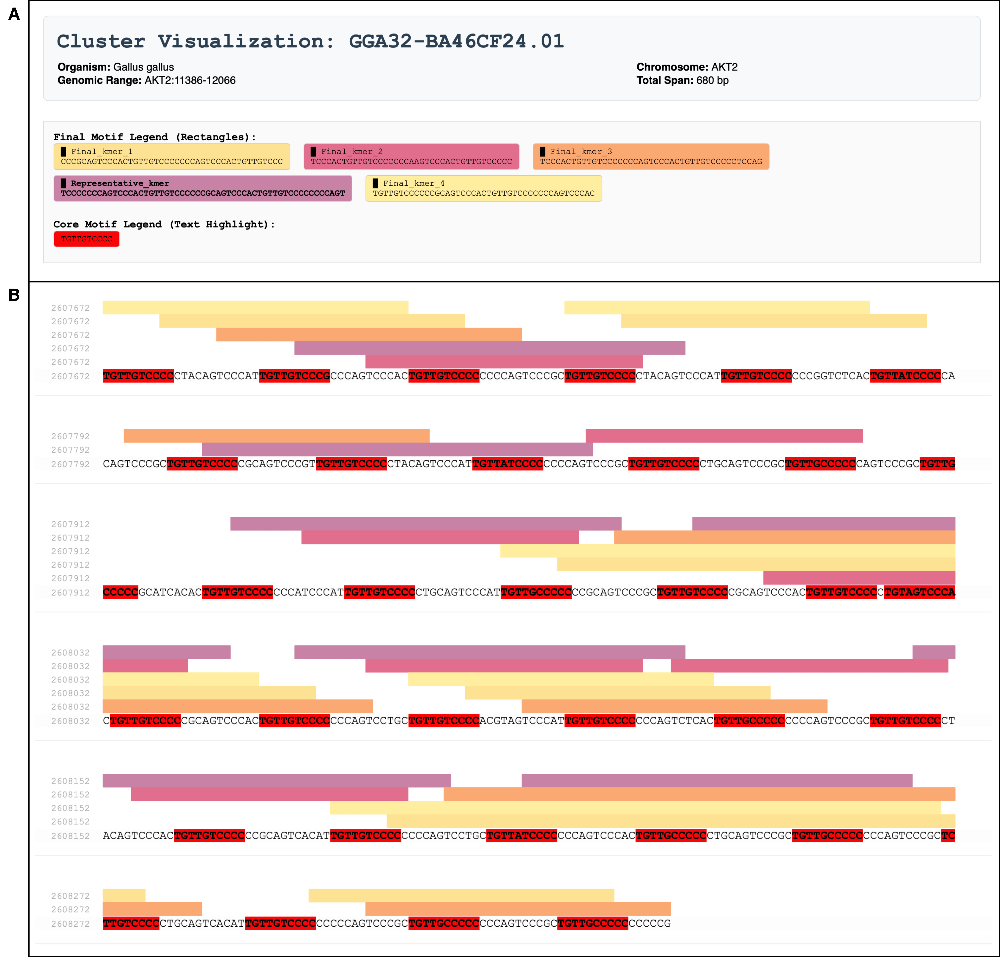

# Repeat Identification and Analysis Pipeline

## Description
Avian genomes exhibit distinct characteristics, shaped by extensive adaptations during their evolution within the dinosaur lineage. For a long time, a number of genes were believed to be evolutionarily lost in avian genomes. However, recent studies suggest that many of these genes are not truly absent but rather located in regions that are technically difficult to analyze—such as microchromosomes. These regions are characterized by high GC content and a high density of repetitive elements, including the sequence stuttering phenomenon. These characteristics may contribute to genomic instability and their further analysis can provide insights into mechanisms of evolutionary change and selection. 

To address this need, a specialized computational pipeline capable of the identification and analysis of repetitive features, including the sequence stuttering phenomenon, has been developed and optimized on the genome of *Gallus gallus*.

## Table of Contents
- [Installation](#installation)
- [Usage](#usage)
- [Input](#input)
- [Output](#output)
- [Parameters](#parameters)
- [Example Usage](#example-usage)
- [Citation](#citation)
- [Contact](#contact)

## Features
- Able to identify sequence stuttering phenomenon = locally expanded motifs resembling tandem repeat expansions where the repeat motif is usually tens to hundred bases long and imperfect. [1]
- Optimized on the genome of *Gallus gallus* but has adaptable parameters
- Performs a systematic analysis of complex repetitive regions
- Offers outputs in the form of a database as well as standardized bioinformatic BED file format
- Possibility of generating a HTML report with detailed information about the repetitive cluster

## Installation

### Prerequisites
Before running the pipeline, ensure the following core tools are installed on your system:
* **[Conda](https://docs.conda.io/en/latest/miniconda.html)** (Miniconda or Anaconda) to manage dependencies.
* **[Nextflow](https://docs.seqera.io/nextflow/install)** (version 22.0+) to execute the workflow.
* **Python** (3.10+)

### Environment Set Up
```bash
git clone --recursive https://github.com/emafialova/Repeat_Pipeline.git 
cd Repeat_Pipeline

# Create and activate environment
conda env create -f environment.yml
conda activate pipeline_env
```

## Usage

The pipeline can be executed in two ways: using the automated **Global Pipeline Wrapper** (recommended for full genomes/batches) or by running **Individual Pipeline Execution** manually (for single sequence troubleshooting). There needs to be a Results folder ready:
```bash
mkdir ./Results
```

1. **Individual Pipeline Execution**

You can run the nextflow pipeline to process one chromosome or one sequence in general, the output information will be stored in an SQLite3 database which needs to be initiated using the following command:
```bash
python scripts/00_db_prep.py ./Results/clusters.db
```

The pipeline's default parameters are set in the `nextflow.config` file, however, you can override any of the parameters using the -- flag and run it using the following command:
```bash
# Run Pipeline
nextflow run main.nf \
    --sequence path/to/your_sequence.fna \
    --chromosome_id "chr1" \
    --sequence_id "target_gene_name" \
    --outdir Results/custom_run \
    --db_path path/to/db

# Additional Filtering as a part of the process
python scripts/Additional_filtering.py --outdir ./Results --db ./Results/clusters.db
```

2. **Global Pipeline Wrapper**

For processing optimization, the pipeline can be executed across multiple chromosomes in parallel. This is the recommended approach for whole-genome analysis and is managed by the provided Python wrapper script: `pipeline_wrapper.py`. The python wrapper includes all steps that need to be done manually in individual execution: database creation and additional filtering at the end.
To run the parallel execution, use the following command:
```bash
python pipeline_wrapper.py \
    path/to/fasta \
    chromosome_prefix \
    --workers 10 \
    --chr_list "chr1,chr2" \
    --org "Gallus gallus" \
    --db_path path/to/db \
    --output_directory path/to/output_directory
```

Below you can find a command that can be used to run this analysis for all *Gallus gallus* chromosomes assuming you have the genome sequence in `data` folder, the output directory is `Results/GG` and the database is stored in `Results` folder:

```bash
python pipeline_wrapper.py \
    ./data/GCA_024206055.2_GGswu_genomic \
    CP1005 \
    --workers 30 \
    --org "Gallus gallus" \
    --db_path ./Results/clusters_GG.db \
    --output_directory ./Results/GG
```

## Additional scripts and features

### **Extract data from database**

In case you want to extract data from database and save it in the form of a csv for further processing or analysis, you can use the prepared script using the following command:
```bash
python data_manipulation/Extract_from_db.py -d path/to/db -o path/to/output.csv -c chrom id start stop gc core_seq region_size
```

2. **Additional Filtering**

The python wrapper for whole genome analysis includes the execution of python script for additional filtering. The goal of this step is to discard low-complexity sequences and artifacts to ensure that the output files only contain high-confidence repetitive clusters. A cluster will only be deemed confident if it follows these 3 rules:
-	**Region Length**: The length of the region must be at least equal to the product of the minimal length of core k-mer and minimum k-mer frequency
-	**Occurrences**: The median of k-mer frequency must be higher or equal to the minimum k-mer frequency
-	**Extension**: At least one core k-mer in the cluster must be extended during the process

## Input
There are only two required inputs for the pipeline: 
- a FASTA sequence file (example is in test_sequence folder), most often a whole genome sequence 
- an organism mapping file (default `KEGG_mapping.txt` is included in this repo). This is used to generate cluster IDs.

## Output
There are several generated outputs:
- BED file 
- SQLite database populated by repeat clusters

Below, you can find an Entity-Relationship Diagram for the SQLite database:

 

It is also possible to generate an HTML visualization using the provided script: `./data_manipulation/HTML_vis.py` or to run an additional python script `./data_manipulation/Summary_plot.py` which creates a barchart with normalized cluster densities per chromosome and outputs average statistics for chromosomal groups

## Recommended Parameter configuration
This pipeline consists of 5 steps, each step has several parameters which can be altered by the user. The results shown below were generated with the following parameter configuration:

| Step | Parameter | Value |
| :--- | :--- | :--- |
| Step 1 |`Min k-mer Length (k)` | 10 | 
| Step 1 |`Min k-mer Frequency (m)` | 10 | 
| Step 1 |`Sliding Window Size (W)` | 10 000 | 
| Step 1 |`Sliding Window Step Size (D)` | 5 000 | 
| Step 2 |`Max Distance Between Occurrences (d)` | 1 000 | 
| Step 2 |`Min Region Length (l)` | 30 | 
| Step 2 |`Min Number of k-mer in a Region (n)` | 10 | 
| Step 3 |`Min Number of k-mer Occurrences (r)` | 7 | 
| Step 3 |`Max k-mer Length (K)` | 2 000 | 
| Step 3 |`Max Hamming Distance (h)` | 15% | 
| Step 3 |`Frequency Threshold (f)` | GC(region) | 
| Step 3 |`Time Limit (t)` | 300 s | 
| Step 5 |`DBSCAN (eps)` | 0.45 | 
| Step 5 |`DBSCAN (MinPts)` | 2 | 
| Additional Filtering |`Region Length` | 70 | 
| Additional Filtering |`Occurrences Median` | 7 | 
| Additional Filtering |`Extension` | YES | 

The configuration was set up on **Gallus gallus genome - assembly GCA_024206055.2_GGswu**.

## Gene AKT2 Analysis
I will demonstrate the usage of the pipeline on the gene AKT2 which is located on the 32nd chromosome **(Gallus gallus genome, assembly GCA_024206055.2_GGswu: CP100586.2:2596287-2608733)**.
Below is a self dotplot generated using the YASS program [2] with default parameters. It is visible that there are several repeat clusters, identifying and analyzing them is the objective of the pipeline.

 

The sequence of this gene is available in the folder `test_data`, results of the pipeline generated for this gene are available in the folder `test_results`. Final clusters bed file is called: `FINAL_clusters.bed`, database with all clusters is available as `clusters_AKT2.db`.

### Results Details
The information about clusters identified and analyzed by this pipeline is automatically loaded into the prepared database. It can be accessed via command line using sqlite3. The database stores information for all clusters across all chromosomes.

Moreover, for each sequence/chromosome, two output files, which store the information, are generated:
- bed file which stores information about position of a cluster and a cluster ID `FINAL_clusters.bed`
- tsv file with cluster information `FINAL_clusters_details.tsv`
The bed file can be loaded into standard bioinformatic tools such as UCSC Genome Browser as custom track, allowing the user to see the positions of the clusters. 

The statistics calculated for each cluster present in both database and the tsv file include:
| Statistic | Description | 
| :--- | :--- | 
| **Region Size (bp)** | The absolute length of the clustered genomic region, from the start of the first occurrence of a final k-mer to the end of the last. |
| **GC Content (%)** | The percentage of guanine and cytosine bases across the whole region. |
| **Coverage Ratio** | The fraction of the total region size that is covered by the final k-mers. *This demonstrates the density of the repeats within the defined region.* |
| **Number of k-mers** | The absolute count of distinct final k-mers present. *This demonstrates the variability of the k-mers present in the region.*  |
| **Median Length (bp)** | The median length of all final k-mers present in the cluster. Using median rather than mean prevents k-mers of extreme sizes of skewing the descriptor. |
| **Average and Median occurrences** | The mean and median frequency counts of all final k-mers. *These metrics show the repetitive nature of the final k-mers in the cluster.* |
| **Conservation Score** | A measure of how similar the final k-mers are to the representative sequence of the cluster. Measured using Levenshtein distance between the k-mers. |
| **Average Raw and Normalized Smith-Waterman Distance** | The mean similarity scores calculated by local pairwise alignment of all final k-mers. *These metrics show the internal cluster cohesion and quantify how closely related the final k-mer sequences are.* |

### HTML Visualization
To visualize a specific cluster, it is necessary to locate its unique ID (e.g. GGA32-BA46CF24.01) in the fourth column of the output .bed file or in the database: field *human_id* in the table *Instances*.  
HTML visualizations of selected clusters are available in the folder `test_results/HTML`, the following command was used to generate that of cluster **GGA32-BA46CF24.01**:
```bash
python ./data_manipulation/HTML_vis.py \
    --db ./test_results/clusters_AKT2.db \
    --fasta ./test_data/AKT2_seq.fasta \
    --id GGA32-BA46CF24.01 \
    --org "Gallus gallus" \
    --out ./test_results/HTML/report_GGA32-BA46CF24.01.html \
    --chunk 120 
```

The generated HTML is split into five parts:
- (A) Header with cluster metadata such as genomic range and organism 
- (B) Sequence visualization where positions of each final k-mer are shown 
- (C) Cluster metrics including information about region length, coverage and GC content
- (D) Phylogenetic tree showing the relations between core k-mers
- (E) Multiple sequence alignment of the final k-mers




## Troubleshooting
The expected run time for a whole genome sequence if utilizing 10 workers is approximately 24 hours. This may vary based on the length and complexity of the DNA sequence.

## Summary
This repository presents a specialized computational pipeline capable of performing a systematic analysis of complex repetitive regions. The pipeline provides a robust framework for repetitive cluster analysis, offering outputs in the form of a database as well as standardized bioinformatic BED file format. Furthermore, the user is also able to generate an HTML report with detailed information about the repetitive cluster. Ultimately, this pipeline serves as a key tool for the analysis of repetitive regions, providing valuable insights that were previously obscured. 

## Citation
If you use this pipeline, please cite:

Fialová, E. (2026). *Repetitive Elements and Stutter Genes in Avian Genomes*. Master's thesis, Univeristy of Chemistry and Technology, Prague, Czech Republic.

## Contact
For any questions or support, please contact:
- ema.fialova@img.cas.cz

## Acknowledgments
This work was carried out with the support of ELIXIR CZ Research Infrastructure (ID LM2023055, MEYS CR)

This pipeline utilizes a standalone Python implementation of a Suffix Array to optimize the initial exact k-mer search. We gratefully acknowledge the work of **dohlee**, whose open-source `pysuffixarray` repository was adapted for this step. 
* Source code available at: [https://github.com/dohlee/pysuffixarray](https://github.com/dohlee/pysuffixarray)

## References
[1] Hron, T.; Miklík, D.; Pačes, J.; Pajer, P.; Pečenka, V.; Hejnar, J.; Nehyba, J.; Elleder, D. Decoding the Avian Missing Gene Mystery: Dot Chromosomes Unmask Extensive Gene Loss and Novel Genetic Instability. Genome Biol. Evol. 2026, 18 (3), evag038. https://doi.org/10.1093/gbe/evag038.

[2] Noé, L., & Kucherov, G. (2005). YASS: enhancing the sensitivity of DNA similarity search. *Nucleic Acids Research*, 33(suppl_2), W540-W543. https://doi.org/10.1093/nar/gki478
