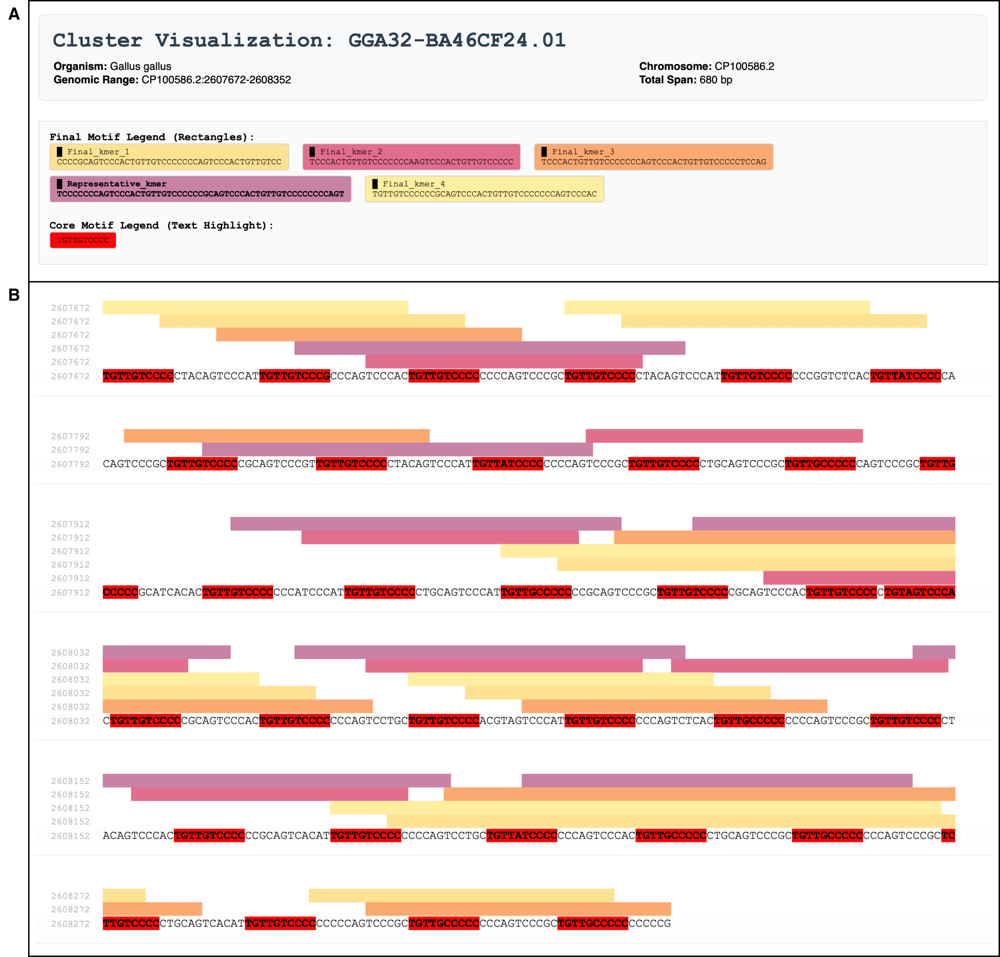
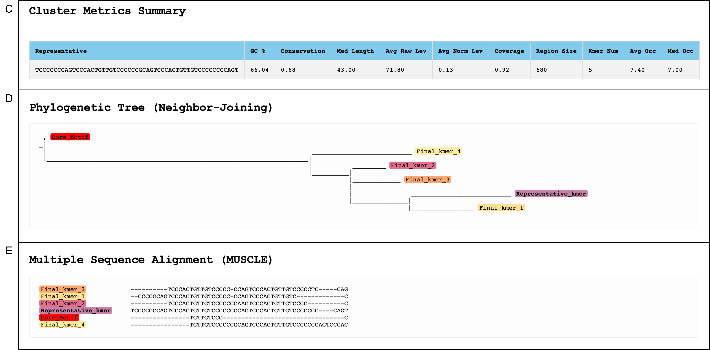

# Repeat Identification and Analysis Pipeline

## Description
This Nextflow-based pipeline can be used to identify and analyze highly repetitive sequence clusters. Originally designed to analyze repeats belonging to the sequence stuttering phenomenon and optimized on the genome of *Gallus gallus*. It reports repeat cluster metadata as well as calculated statistics.

## Features
- localizes imperfect repeats
- thresholds adaptable to a given usecase
- provides output in the form of an SQLite database 
- calculates statistics for each cluster (see table with details below)
- possible HTML visualization for selected repeat cluster `html_vis_db_usage.py`

## Instalation

### Prerequisites
Before running the pipeline, ensure the following core tools are installed on your system:
* **[Conda](https://docs.conda.io/en/latest/miniconda.html)** (Miniconda or Anaconda) to manage dependencies.
* **[Nextflow](https://www.nextflow.io/docs/latest/getstarted.html)** (version 22.0+) to execute the workflow.

### Environment Set Up
```bash
git clone https://github.com/emafialova/Repeat_Pipeline.git
cd YourRepoName

# Create and activate environment
conda env create -f environment.yml
conda activate pipeline_env
```
## Usage

### Paralel Run for Whole Genome Analysis
For processing optimization, the pipeline can be executed across multiple chromosomes in paralel. This is the recommended approach for whole-genome analysis and is managed by the provided python wrapper script: `run_all_chr_mp.py`
To run the parallel execution, use the following command:
```bash
python run_all_chr_mp.py --data_source path/to/fasta --chromosome_prefix chr --workers 10
```
If you wish to use the pipeline only on a selected subset of the chromosomes, use the optional chr_list flag:
```bash
python run_all_chr_mp.py --data_source path/to/fasta --chromosome_prefix chr --workers 10 --chr_list "chr1,chr2,chr3"
```

### Single nextlfow pipeline run
If you want to process a single sequence, you can bypass the wrapper and run the Nextflow pipeline directly. The pipeline's default parameters are set in the `nextflow.config` file, however, you can override any of the parameters using the -- flag.
```bash
nextflow run main.nf \
    --sequence path/to/your_sequence.fna \
    --chromosome_id "chr1" \
    --sequence_id "target_gene_name" \
    --outdir Results/custom_run
    --db_path path/to/db
```

## Input
There are only two required inputs for the pipeline: a FASTA sequence file (example is in test_sequence folder) - most often a whole genome sequence and a KEGG organism mapping file (`KEGG_mapping.txt` included in this repo).

## Output
There are several generated outputs:
- SQLite database populated by repeat clusters
- BED file 
It is also possible to generate an HTML visualization using the provided script: `html_vis_db_usage.py`

## Final Parameter configuration
This pipeline consists of 5 steps, each step has several parameters which can be altered by the user. The results shown below were generated with the following parameter configuration:

| Step | Parameter | Value |
| :--- | :--- | :--- |
| Step 1 |`Min k-mer Length (k)` | 10 | 
| Step 1 |`Min k-mer Frequency (m)` | 10 | 
| Step 1 |`Sliding Window Size (W)` | 10 000 | 
| Step 1 |`Sliding Window Step Size (D)` | 5 000 | 
| Step 2 |`Max Distance Between Occurrences (d)` | 1 000 | 
| Step 2 |`Min Region Length (l)` | 30 | 
| Step 2 |`Min Number of k-mer in a Region (n)` | 10 | 
| Step 3 |`Min Number of k-mer Occurrences (r)` | 7 | 
| Step 3 |`Max k-mer Length (K)` | 2 000 | 
| Step 3 |`Max Hamming Distance (h)` | 15% | 
| Step 3 |`Frequency Threshold (f)` | GC(region) | 
| Step 3 |`Time Limit (t)` | 300 s | 
| Step 5 |`DBSCAN (eps)` | 0.45 | 
| Step 5 |`DBSCAN (MinPts)` | 2 | 
| Additional Filtering |`Region Length` | 70 | 
| Additional Filtering |`Occurrences Median` | 7 | 
| Additional Filtering |`Extension` | YES | 

The configuration was set up on **Gallus gallus genome, assembly GCA_024206055.2_GGswu**.

## Example usage
I will demonstrate the usage of the pipeline on the gene AKT2 which is located on the 32nd chromosome **(Gallus gallus genome, assembly GCA_024206055.2_GGswu: CP100586.2:2596287-2608733)**.
Below is a self dotplot generated using the YASS program with default parameters. It is visible that there are several repeat clusters, identifying and analyzing htem is the objective of the pipeline.

 

The sequence of this gene is available in the folder `test_data`, results of the pipeline generated for this gene are available in the folder `test_results`. Final clusters bed file is called: `cluster_islands_C7_new.bed`, database with all clusters is avaialble as `clusters_db_AKT2.db`.

The results were generated using the command below:
```bash
nextflow run main.nf \                        
    --sequence ./test_data/AKT2_seq.fasta \
    --chromosome_id "CP100586.2" \
    --sequence_id "AKT2" \
    --outdir ./test_results/AKT2 \
    --db_path "$(pwd)/test_results/clusters_db_AKT2.db"
```


HTML visualization of selected clusters is available in the folder `test_results/HTML` and each was generated by the following command:
```bash
python html_vis_db_usage.py \
    --db ./test_results/clusters_db_AKT2.db \
    --fasta ./test_data/AKT2_seq.fasta \
    --id GGA32-BA46CF24.01 \
    --org "Gallus gallus" \
    --out ./test_results/HTML/report_GGA32-EDE6ACC5.01.html \
    --chunk 120 
```

The generated HTML is split into five parts:
- (A) header with cluster metadata such as genomic range and organism 
- (B) sequence visualization where positions of each final k-mer are shown 
- (C) cluster metrics including information about region length, coverage and GC content
- (D) phylogenetic tree showing the relations between core k-mers
- (E) multiple sequence alignment of the final k-mers





